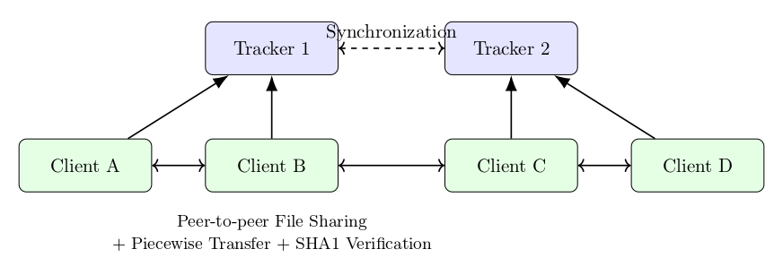

# 🧩 Peer-to-Peer Distributed File Sharing System

A **C/C++ based Peer-to-Peer (P2P) File Sharing System** built using **socket programming**, **multi-threading**, and **system calls**, enabling **secure, redundant, and efficient file transfers** across peers.
The system supports **multi-tracker synchronization**, **piecewise parallel downloads**, and **SHA1-based integrity verification**, ensuring resilience and scalability.

---

## 🚀 Features

### 🧑‍💻 1. Account Management

* Register and log in users with SHA1-based password hashing.
* Secure credential verification handled by the tracker.

### 👥 2. Group Management

* Create, join, and manage user groups.
* Owners can approve or reject join requests.
* File sharing is group-based for better access control.

### 📁 3. File Sharing

* Upload file metadata (location + SHA1 hash) to the tracker.
* Download files in **512KB chunks** from multiple peers concurrently.
* Once a peer downloads a piece, it can immediately share it with others.
* File integrity verified for each piece and the final assembled file.

### ⚙️ 4. Piece Selection Algorithm

* Custom algorithm prioritizes peers with **least load** to **balance network traffic**.
* Enables **parallel downloads** for maximum speed and resource utilization.
* Each peer serves as both a **client and a mini-server**, improving scalability.

### 🧭 5. Multi-Tracker Synchronization

* Two (or more) trackers run in parallel and synchronize metadata (users, groups, files).
* Implemented using **socket communication** between trackers.
* Ensures fault tolerance — if one tracker fails, others seamlessly take over and resync when recovered.

### 🧵 6. Concurrency & Robustness

* Multi-threading handles concurrent file downloads/uploads efficiently.
* Window sizing and buffered transfers ensure smooth TCP communication.
* Built-in error handling for abrupt peer disconnections, tracker downtime, and invalid file transfers.

---

## 🏗️ System Architecture

### 🔹 Trackers

* Maintain global metadata of users, groups, and files.
* Continuously synchronize data between each other using sockets.

### 🔹 Clients

* Perform user and group operations.
* Upload and download files.
* Handle multi-threaded piecewise transfers and integrity checks.

<p align="center">
  
</p>

---

## ⚡ Implementation Highlights

| Component        | Technology Used  | Description                              |
| ---------------- | ---------------- | ---------------------------------------- |
| Communication    | TCP Sockets      | Client–Tracker and Peer–Peer connections |
| Hashing          | SHA1             | File and chunk integrity verification    |
| Concurrency      | pthreads (C++)   | Multi-threaded download/upload           |
| Synchronization  | Socket-based     | Tracker-to-tracker synchronization       |
| Piece Management | Custom Algorithm | Load-balanced piece selection            |

---

## 🧪 Testing

* Tested with **multiple clients** downloading and sharing files concurrently.
* Simulated **tracker crashes**, **abrupt peer exits**, and **network delays**.
* Verified successful **resynchronization** between trackers after downtime.
* Logs used to trace communication and ensure smooth synchronization.

---

## 🔧 Setup & Execution

### 1️⃣ Compile and Run Trackers

```bash
make
./tracker tracker_info.txt <tracker_id>
# Example:
./tracker tracker_info.txt 1
```

Ensure that `tracker_info.txt` contains IP and port details of all trackers.

### 2️⃣ Compile and Run Clients

```bash
make
./client <IP>:<PORT> tracker_info.txt
# Example:
./client 127.0.0.1:6000 tracker_info.txt
```

---

## 💡 Available Commands

| Command                                                   | Description                         |
| --------------------------------------------------------- | ----------------------------------- |
| `create_user <user_id> <passwd>`                          | Create a new user account           |
| `login <user_id> <passwd>`                                | Log in existing user                |
| `create_group <group_id>`                                 | Create a new group                  |
| `join_group <group_id>`                                   | Send request to join a group        |
| `leave_group <group_id>`                                  | Leave an existing group             |
| `list_requests <group_id>`                                | View pending join requests          |
| `accept_request <group_id> <user_id>`                     | Accept a user's join request        |
| `reject_request <group_id> <user_id>`                     | Reject a user's join request        |
| `list_groups`                                             | List all available groups           |
| `list_my_groups`                                          | List groups you are part of         |
| `list_files <group_id>`                                   | List all shareable files in a group |
| `upload_file <file_path> <group_id>`                      | Upload file metadata to tracker     |
| `download_file <group_id> <file_name> <destination_path>` | Download file                       |
| `show_downloads`                                          | Display active/completed downloads  |
| `stop_share <group_id> <file_name>`                       | Temporarily stop sharing a file     |
| `logout`                                                  | Log out user                        |
| `exit`                                                    | Exit the client or tracker          |

---

## 🧠 Assumptions

* At least **one tracker remains online** at all times.
* Files are split into **512KB pieces** for transfer.
* Piecewise and overall file hashes ensure data authenticity.
* Stopped shares can resume automatically when requested again.

---

## 🧩 Future Enhancements

* Add GUI-based dashboard for file and peer management.
* Implement encryption for secure data transmission.
* Introduce tracker election for decentralized leadership.

---

## 🧑‍💼 Author

**Zia Mahmood Hussain**

**Tech Stack:** C++, Socket Programming, Multi-threading, Distributed Systems

[LinkedIn](https://www.linkedin.com/in/zia-mahmood-hussain/) • [GitHub](https://github.com/Zia-Mahmood)

---